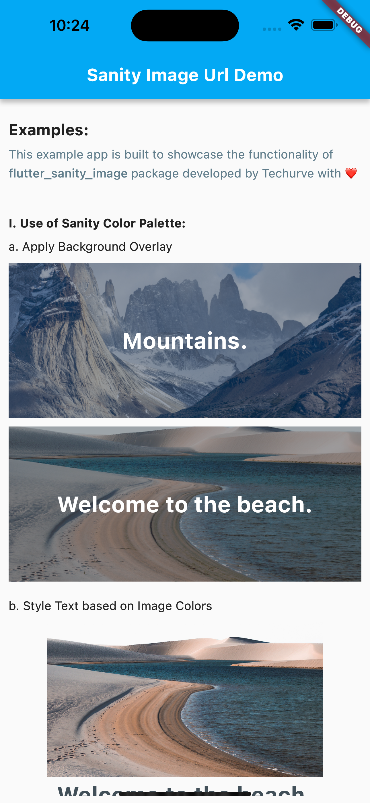

<!--
This README describes the package. If you publish this package to pub.dev,
this README's contents appear on the landing page for your package.

For information about how to write a good package README, see the guide for
[writing package pages](https://dart.dev/guides/libraries/writing-package-pages).

For general information about developing packages, see the Dart guide for
[creating packages](https://dart.dev/guides/libraries/create-library-packages)
and the Flutter guide for
[developing packages and plugins](https://flutter.dev/developing-packages).
-->

# Flutter Sanity Image URL

A dart package to quickly generate sanity image urls.
Ported from [sanity-io/image-url](https://github.com/sanity-io/image-url).

Intented to be used together with the [flutter_sanity package](https://pub.dev/packages/flutter_sanity)

## Features

- Respects crops and hotspots specified in Sanity.
- Can be used to set the width and/or height of the image.
- Provides a builder to access the processing options available from Sanity.

<p align="center">
    
</p>

## Getting started

```bash
dart pub add flutter_sanity
dart pub add flutter_sanity_image_url
```

## Usage

See `/example` for a full example.

### Creating a builder:

```dart
// sanityClient is an instance of SanityClient from flutter_sanity
final builder = ImageUrlBuilder(sanityClient);

ImageUrlBuilder urlFor(asset) {
  return builder.image(asset);
}
```

### Using the builder:

using the builder design patten the options can be added in a chain, always call `url()` at the end to get the actual url of the image.

```dart
Image.network(urlFor(image).size(200, 200).url())
```
